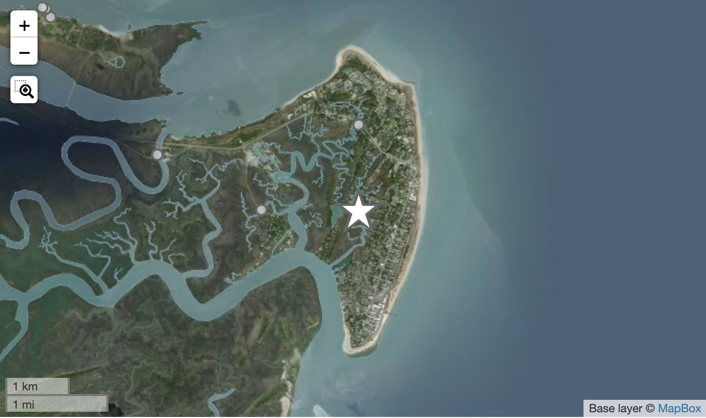
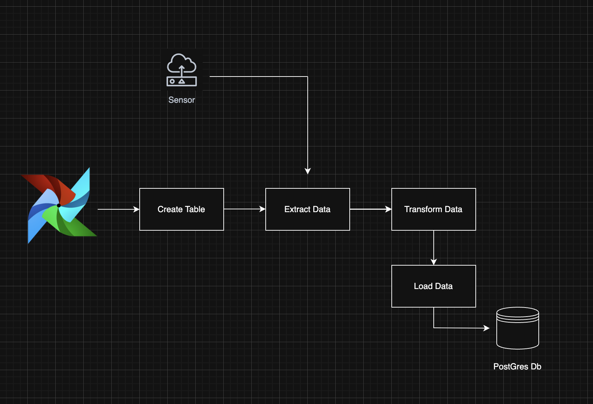

# SensorPipeline

A production Apache Airflow ETL pipeline that batch-streams high-frequency water level readings from the **Tybee Island gt-envsense-069** IoT sensor. The pipeline automatically fetches, transforms, and stores sensor data into a PostgreSQL database for downstream analysis and model validation.



---

## Overview

This project is part of an environmental sensing initiative that leverages IoT infrastructure to monitor sea level trends in real-time. The goal is to enable data-driven flood risk modeling, early warning systems, and climate-adaptive urban planning through automated data ingestion and archiving.

---

##  Architecture

The pipeline is implemented using [Apache Airflow](https://airflow.apache.org/) and consists of the following components:

### DAG: `sensor_pipeline`

| Step | Description |
|------|-------------|
| `create_table()` | Ensures the target PostgreSQL table exists with correct schema. |
| `extract_sensor_data()` | Pulls latest water level readings from the SeaLevelSensors API (Datastream 262). |
| `transform_sensor_data()` | Converts raw JSON responses into structured tabular format. |
| `load_data_to_postgres()` | Inserts the transformed data into a PostgreSQL database. |

### Pileline Architecture Diagram 


---

## Data Source

- **Sensor**: `gt-envsense-069` (Tybee Island)
- **API Endpoint**: [`https://api.sealevelsensors.org/v1.0/Datastreams(262)/Observations`](https://api.sealevelsensors.org)
- **Data Format**:
  ```json
    {
      "@iot.selfLink": "https://api.sealevelsensors.org/v1.0/Observations(27099756)",
      "@iot.id": 27099756,
      "phenomenonTime": "2025-06-20T23:06:29.345927Z",
      "resultTime": "2025-06-20T23:06:29.345927Z",
      "result": -2.924,
      "parameters": {
        "gateways": [
          {
            "snr": 8,
            "name": "gatech-coastal-108",
            "rssi": -98
          }
        ],
        "gateway_count": 1
      }
    }
  ```

---

##  Database Schema

The pipeline writes observations into the `sensor_data` table:

```sql
CREATE TABLE IF NOT EXISTS stock_data (
    timestamp TIMESTAMP NOT NULL,
    result NUMERIC(10, 4),
    PRIMARY KEY (timestamp)
);
```

- `timestamp`: Time of measurement (UTC)
- `result`: Water level reading (meters)

---

## Scheduling

- **Frequency**: Every 8 hours (00:00, 08:00, 16:00 UTC)
- **Airflow Cron Expression**: `0 */8 * * *`
- **Backfill**: Disabled (`catchup=False`)

---

## 🤝 Acknowledgements

- [SECOORA](https://secoora.org) for sensor infrastructure
- [SensorThings API](https://github.com/opengeospatial/sensorthings) for standardization
- Georgia Tech Environmental Sensing Lab
